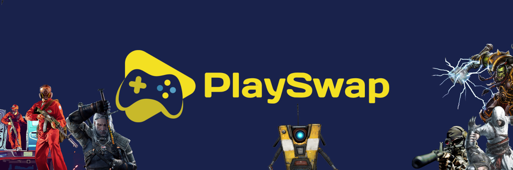

# Project overview

PlaySwap is an innovative infrastructure that bridges mainstream gaming, AAA games included, and Web3 by building an ecosystem that connects both worlds. 

PlaySwap enables the community to monetize their time playing games on their PC, Xbox, PS4, and PS5, earning $PLAY. On top of this, Playswap developed an AMM (Automated Market Maker) Swap to serve the community as an entry point into DeFi.

The decentralized gaming infrastructure developed on the BNB Blockchain with a specific goal: To become the point of entry of the mainstream gaming community into the Crypto.

The AMM swap allows users to exchange tokens on the BNB blockchain network. The liquidity provided to the exchange comes from Liquidity Providers ("LPs") who stake their tokens in Liquidity Pools. In exchange, a user gets LP tokens that he can stake to earn PLAY tokens in the "Farms"
 
**Fill the gap:** during the last years (2021-2022) there was a massive growth of the Play to Earn gaming space. The problem to solve is that most of these games are not attractive/good enough for the vast majority of the mainstream gaming community. Therefore PlaySwap is developing a solution that will allow these gamers to generate active and passive income while playing their favorite games without changing their habits and favorite devices.
 
The mainstream gaming industry is one of the biggest industries in the world, with hundreds of millions of gamers worldwide. The vast majority of gamers worldwide like to play AAA games but have no interest in the recent GameFi Web3 industry due to the poor quality of the games. On the one hand, they don't like the quality of the games, but on the other hand, they are still not aware of the power of the cryptoverse and the DeFi ecosystem. PlaySwap will close this gap and become the bridge between these two worlds.

All gamers of our amazing community will be able to play their favorite games on **PS4, PS5, Xbox, PC,** and at the same time, monetize the time they spend gaming. With this monetization, community will also get to know blockchain and crypto, understand the opportunities DeFi has to offer, and potentially become active DeFI, GameFi, Swappers, Collectors etc etc.

The team of Playswap is highly committed to provide actual value, fairness, and innovation to decentralized finance through our high-quality products and services. PlaySwap is fast, decentralized and anyone can swap and earn tokens.

**Are you ready? Let's go!**

