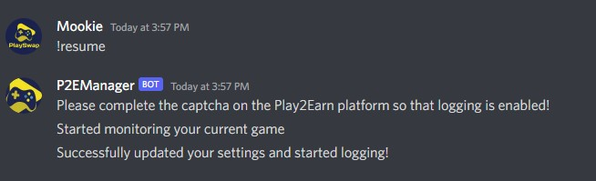

# Anti cheat CAPTCHA

In order to avoid "miners" of the P2E protocol, we have enabled an hourly CAPTCHA that must be solved by players in order to keep earning.

## Rules:

- For every hour of gaming, the user will have 10m to solve the CAPTCHA. If the CAPTCHA is not solved, the user will lose the last 1h10m of earnings.

- If the user has failed the captcha but is back, it is required to send a DM to the P2Emanager bot with the text: “!resume.”

- The bot will enable a new captcha on the platform that must be solved.

- Bellow, you can find an example of the !resume message you need to send to the P2EManager bot:

- If you don’t want to be bothered with CAPTCHAS, at any moment you can pause the P2E protocol and focus on your gaming. Send a !pause message to the Bot.