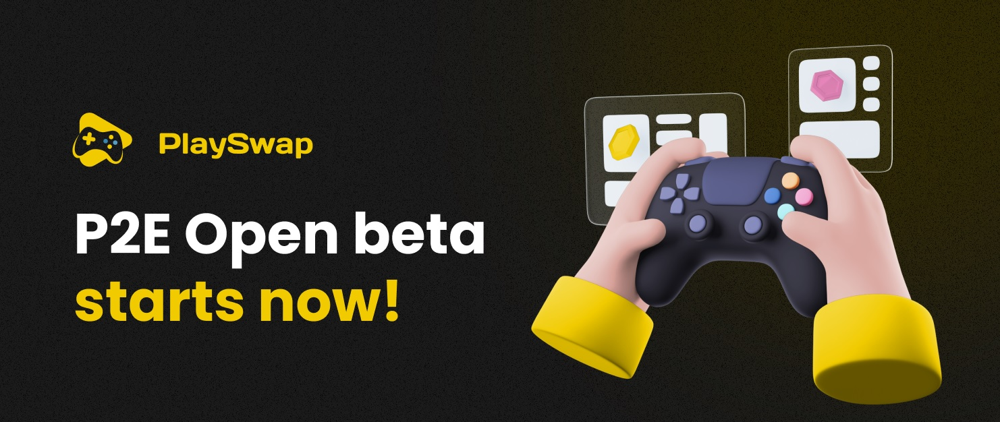

# Project update: Open Beta, Supported platforms and games.

**Hello PlayFam**,

It's time to join & enjoy our Open Beta 2.0!

As you know, this is a Beta version of the protocol. We are releasing it to the public to show you the protocol will work as we have been advertising it, and to test and gather community feedback to improve the mainnet release of the protocol.

**So, what can you expect?**

1) The main purpose of the open beta is to test the protocol's limits, features, and possible bugs. Issues/bugs might occur, and this is a good thing. Feel free to test and use the protocol as much as you want. Contact the team on the appropriate Discord channel if you have feedback or anything to report. Now is the time when we can make improvements and fix bugs to improve your experience with the protocol in the future. 

2) The website shows a simple design that is not final. We  will make changes before the mainnet launch. Once again, chat with us on Discord if you have something to share.

3) The open beta 2.0 will take place on BNB chain testnet. 

**Platforms supported:**

The protocol will support:
- **PC**
- **PlayStation 4**
- **PlayStation 5**
- **Xbox.**

## Games supported.

In order to increase the adoption of the community and to show you the real power of the protocol we have decided to disable the “whitelisted games” and we are happy to announce that we will support 1800+ games right from the start.

Click [HERE](https://docs.playswap.org/open-beta/supported-games/) to check the complete list of supported games.

Sounds good right? 

## How to start?

To join our protocol and start earning PLAY you just need to:

1) Join the official discord server and verify yourself.
2) Open a DM with the bot “P2EManager” identified with the role “Play2Earn Wizard” and type !register “address”

3) Start playing

If you don’t know how to connect to the BNB chain testnet and create your wallet, click [HERE.](https://docs.playswap.org/open-beta/connect-metamask-to-testnet/)

- You will be able to claim your earnings once a day.

To interact with the blockchain and claim your tokens, you must have BNB. You can use [THIS](https://testnet.binance.org/faucet-smart) faucet to get BNB.

After opening the page, you simply need to add your Wallet address and wait for the BNB to arrive.

This is it. Now is the time to test the protocol, share the project with your friends, and bring them on to join our community.

**Together we can do great things.**

